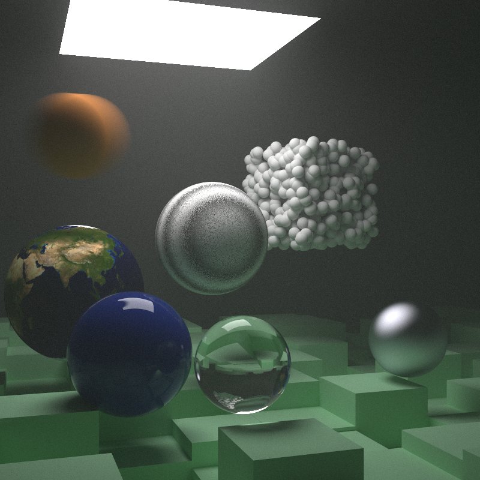
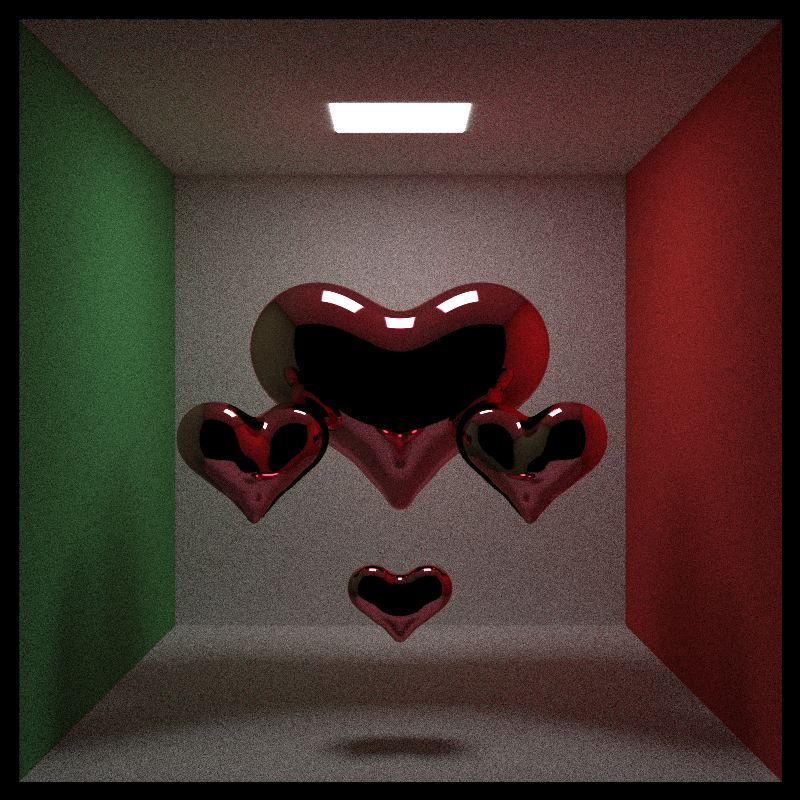
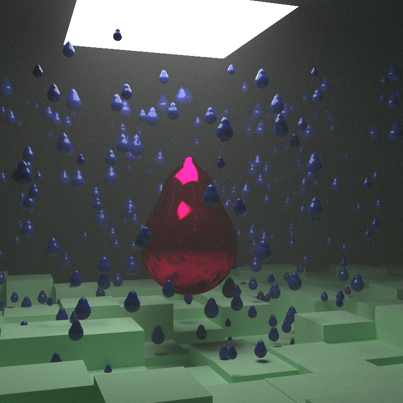
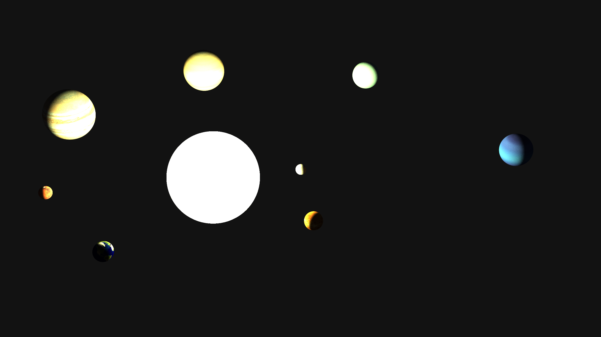
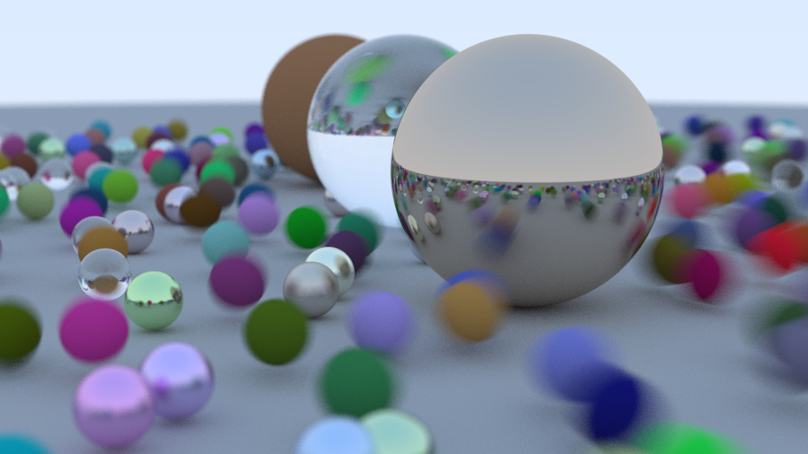

# Rusty Raytacing

### Implementation of [ray tracing in one weekend](https://raytracing.github.io/books/RayTracingInOneWeekend.html) books 1-2 and some of 3.

Most of the code is almost a one-to-one translation of the C++ code from the book to Rust with the obvious 
changes to the way inheritance / traits work in the two languages. However, I've also added some multithreading (NO GPU support tho) and
some ray marched metaballs that allow for the creation of nice ooblong shapes.

Here are some sample images:

